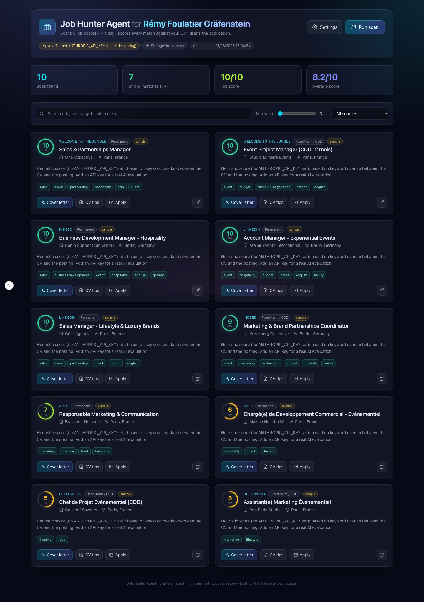

# Job Hunter Agent for Rémy Foulatier Gräfenstein

> An autonomous AI recruiter. Four times a day it scans **5 job boards**, scores
> every posting **1–10** against your CV, writes tailored **cover letters**,
> suggests **CV improvements**, and prepares each application as a reviewable
> **Gmail draft** — all from a premium dark **glassmorphism** dashboard.



Built for the Antigravity Agentic Coding Curriculum. Targets **Sales / Event
Management / Marketing** roles (hospitality & lifestyle) in **Berlin or Paris**,
on fixed-term (CDD) and permanent contracts.

---

## ✨ Features

| Capability | How it works |
|---|---|
| **5 job scrapers** | Welcome to the Jungle, APEC, Indeed, LinkedIn, HelloWork. Each tries a real public endpoint, then falls back to bundled sample jobs so a scan never fails. |
| **CV parser** | Extracts text from **PDF** (`pdf-parse`) and **Word `.docx`** (`mammoth`). Available as a library, an upload endpoint, and a CLI. |
| **AI evaluator** | Claude grades each job **1–10** and returns concrete **matching** + **missing** skills with a rationale (forced structured tool output). |
| **Cover letters** | Tailored, language-matched letters generated per job — fully editable before sending. |
| **CV suggestions** | Per-job, paste-ready CV edits you can accept or dismiss. |
| **Gmail drafts** | Creates a **draft** (never auto-sends) with the cover letter + CV attached. You review and click send. |
| **4×/day schedule** | GitHub Actions cron hits a secured endpoint every 6 hours. |
| **Dashboard** | Glassmorphism UI: score badges, stats, filters, skeleton loaders, modals, settings. |

The app **runs with zero configuration** (sample jobs + a transparent keyword
heuristic). Adding API keys upgrades it to real scraping, AI scoring, and Gmail.

---

## 🧱 Tech stack

- **Next.js 15** (App Router) + **React 19** + **TypeScript** — one deployable (UI + API).
- **Tailwind CSS v4** — dark glassmorphism theme.
- **Anthropic Claude API** — scoring (`claude-sonnet-4-6`) + writing (`claude-opus-4-8`).
- **pdf-parse** + **mammoth** — CV parsing.
- **googleapis** — Gmail drafts via OAuth2.
- **Vercel KV** (optional) — persistence; in-memory fallback otherwise.

---

## 🚀 Quick start

```bash
# 1. Install
npm install

# 2. Configure (optional — the app runs without it)
cp .env.example .env.local
#   then add at least ANTHROPIC_API_KEY for real AI scoring

# 3. Run
npm run dev
#   open http://localhost:3000 and click "Run scan"
```

### CLI tools

```bash
# Parse a CV (PDF / Word / txt) to text
npm run parse-cv -- path/to/cv.pdf
npm run parse-cv -- path/to/cv.docx --json

# Run one full scan from the terminal (scrape → score → print)
npm run scan
```

---

## 🔑 Environment configuration

Copy `.env.example` → `.env.local` (local) and add the same vars in Vercel for
production. Every key is optional; each unlocks a capability:

| Variable | Purpose |
|---|---|
| `ANTHROPIC_API_KEY` | Real AI match scoring, cover letters, CV suggestions. |
| `NEXT_PUBLIC_APP_USER_NAME` | Name shown in the dashboard title. |
| `GOOGLE_CLIENT_ID` / `GOOGLE_CLIENT_SECRET` | Gmail OAuth app. |
| `GOOGLE_REDIRECT_URI` | OAuth callback (default `http://localhost:3000/api/gmail/callback`). |
| `GOOGLE_REFRESH_TOKEN` | Minted once via `/api/gmail/auth`. |
| `GMAIL_USER` | The Gmail address drafts are created in. |
| `CRON_SECRET` | Protects `/api/cron`; match it in GitHub Actions. |
| `KV_REST_API_URL` / `KV_REST_API_TOKEN` | Vercel KV persistence (optional). |

### Connecting Gmail (one time)

1. In Google Cloud Console, enable the **Gmail API** and create **OAuth Web**
   credentials. Add your redirect URI.
2. Set `GOOGLE_CLIENT_ID` / `GOOGLE_CLIENT_SECRET` / `GOOGLE_REDIRECT_URI`.
3. Run the app and visit **`/api/gmail/auth`**, grant access, and copy the
   `GOOGLE_REFRESH_TOKEN` shown on the callback page into your env.

> Gmail is **drafts only** by design — the agent never sends mail on its own.

---

## ⏰ The 4×/day schedule

Two options ship in the repo:

- **GitHub Actions (default, free):** [`.github/workflows/cron-scan.yml`](.github/workflows/cron-scan.yml)
  runs `cron: "0 */6 * * *"` (every 6h). Add repo **secrets**:
  - `VERCEL_APP_URL` — your deployed base URL.
  - `CRON_SECRET` — same value as the Vercel env var.
- **Vercel Cron:** [`vercel.json`](vercel.json) includes a daily cron
  (Vercel Hobby allows once/day; use GitHub Actions for the full 4×/day).

Trigger a scan manually anytime from the **Actions** tab → *Run workflow*.

---

## ☁️ Deploy to Vercel

```bash
bash scripts/deploy-vercel.sh      # installs the CLI if needed, deploys --prod
```

Then add your environment variables in the Vercel dashboard and update
`GOOGLE_REDIRECT_URI` to your production `/api/gmail/callback` URL.

## 📦 Publish to GitHub

```bash
bash scripts/publish-github.sh     # creates job-hunter-agent-for-remy-foulatier-grafenstein + pushes
```

---

## 🗂️ Project structure

```
src/
  app/                 # dashboard page + API routes (scan, jobs, cv, cover-letter, apply, cron, gmail)
  components/          # JobCard, ScoreBadge, modals, settings, icons
  lib/
    scrapers/          # 5 site scrapers + fallback + orchestrator
    ai/                # Claude client, scorer, cover-letter, cv-suggestions
    cv/parse.ts        # PDF + Word CV parsing
    gmail.ts           # Gmail draft creation
    store.ts           # KV-or-memory persistence
    config.ts          # branding + search criteria
scripts/               # parse-cv, scan-once, deploy-vercel, publish-github
data/                  # sample-jobs.json, cv.example.txt
.github/workflows/     # 4×/day cron
```

---

## 📝 Submission (Trello)

Paste both links into the designated Trello card, **labelled with your name**:

- **GitHub:** `https://github.com/<you>/job-hunter-agent-for-remy-foulatier-grafenstein`
- **Vercel:** `https://job-hunter-agent-for-remy-foulatier-grafenstein.vercel.app`

---

## ⚠️ Notes & honest limitations

- **Scraping** real boards is brittle and bound by each site's ToS; live fetches
  use public endpoints with timeouts and fall back to sample data. For heavy
  production scraping, use official APIs or a compliant provider.
- **Gmail** creates drafts only — review every application before sending.
- **In-memory storage** resets on restart; add Vercel KV for durable history.
